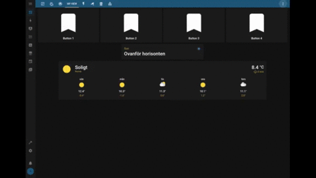

bootstrap-grid-card
===================

Do you love [Bootstrap](https://getbootstrap.com/) grid system and are looking for a way to get
control over lovelace layout in both your browser and mobile app? Then this card is for you.

This card loads `bootstrap-grid.css` into lovelace and provides an easy way of configuring cards
with different bootstrap classes in yaml.



## Install

See development section.

## Usage

First of all, if you don't know how to use [Booststrap grid](https://getbootstrap.com/docs/5.0/layout/grid/)
system, I strongly suggest you to read about it before continuing. This guide will not cover that.

Example configuration:

```yaml
title: My view
panel: true
cards:
  - type: "custom:bootstrap-grid-card"
    cards:
       - type: row
         cards:
            - type: button
              class: "col-3"
              <...>
            - type: button
              class: "col-9"
              <...>
       - type: row
         class: "justify-content-md-center"
         cards:
            - type: entity
              class: "col-6"
              <...>
```

> Note: `panel: false` is not tested and probably not what you want.

## Rows and columns

The bootstrap-grid-card provides two custom card types: `row` and `col` to be used in the `cards` list
of `bootstrap-grid-card`, `row` and `col` card.

The `type: row` and `type: col` card will wrap their `cards` list in a div with the `row` and `col`
class respectively.

A normal card (e.g. `type: button`) will always be a column and have the class `col*` added to it. So
there is no need of adding a `type: col` around a single card.

## Bootstrap classes

You can set bootstrap classes using the `class` config on following card types:

* `custom:bootstrap-grid-card`: Div representing the bootstrap container. **Default:** `container-fluid`.
* `row`: Div representing a row. **Default:** `row`.
* `col`: Div representing a col. **Default:** `col`.
* `<any-card-in-the-above-cards-list>`: Sets the class to the card´s HTML container. **Default:** `col`.

## Nesting rows and columns

It is possible to nest rows and columns any number of times as long there are no
non-`bootstrap-grid-card`´s in between. For example, it will not work if you put a `row` card
in a `horizontal-stack` card.

More advanced example:

```yaml
  # ...
  - type: row
    class: justify-content-md-center
    cards:
      - type: button
        class: "col-xs-12 col-sm-12 col-md-6 col-lg-5"
        # ...
      - type: vertical-stack
        class: "col-xs-12 col-sm-12 col-md-3 col-lg-3"
        cards:
          - type: sensor
            # ...
          - type: sensor
            # ...
      - type: col # Nesting start
        class: "col-xs-12 col-sm-12 col-md-3 col-lg-3"
        cards:
          - type: row
            cards:
              - type: thermostat
                # Use default class "col".
                # ...
              - type: markdown
                # Use default class "col".
                # ...

```

## Development

```bash
# First time to install all deps
npm install

# Build card
npm run build

# Copy to home assistance www folder
cp dist/bootstrap-grid-card.js <home_assistant>/config/www/bootstrap-grid-card.js

# In lovelace UI: clear cache, reload resources and reload page
```
